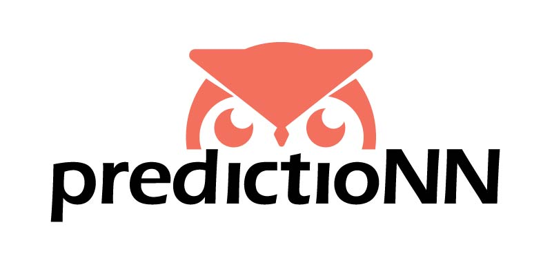

# From the book: [From Concepts to Code](https://www.amazon.com/Concepts-Code-Adam-P-Tashman/dp/1032517980/ref=sr_1_1?crid=1HYVS7KO1U5O6&dib=eyJ2IjoiMSJ9.8E25eTMQhIIvi2qnbvERvOZW1QaICz1Hk3r8dW90sWypECTDAsFipr986vNIzAPZ50HLo9AG0i59D3nVxDYOzXsyoffoqN_QxRckDkCGI6DvoeRZ7YmW39ssjvO2Sy7VrXjGLyTxfiE0R_aaYnEX1oYKxagtQGlhvK5zdK5my2Hutv-XbC502f9klKoCPwzhdxj1HHEsgYRm18Co8PKE8xCwM-_qTya2Ig7_zyJvfIw.Gje3cjzuOVLfmJ8hjmDXBRbPH73tK_zXEWc1BalVj7g&dib_tag=se&keywords=from+Concepts+to+Code&qid=1754198462&sprefix=from+concepts+to+code%2Caps%2C96&sr=8-1)

## Materials for Two-Semester Intro to Data Science Course at High School Level

### This document serves as the course Syllabus

### PredictioNN

PredictioNN provides data science resources for teachers, students, and practitioners.  
Visit the [website](https://prediction-n.com/) to learn more!

### Course Description 

Data science is an applied science that solves problems using mathematics, statistics, computing, data, and domain expertise.  The steps are organized and implemented with a pipeline. In this course, students will work in teams to solve a data science problem, learning and using essential skills along the way: coding, data preprocessing, summarization, visualization, modeling, troubleshooting and communication. At the end of the course, students will be responsible for deliverables, including a presentation. 

### Demand for Data Science

Data science is one of the most in-demand roles globally, and supply of data scientists cannot keep up with demand. Training and curiosity are required to make discoveries in this essential role. One of the goals of this course is to provide this training and develop this curiosity.

### Prerequisites
- an algebra course that introduces:
  - functions
  - linear regression (this is preferred but not required)

### Assumed Class Meeting Time
- classes meet for 40 minutes twice a week

### One Semester Course Format
- A one-semester course can use the Semester 1 material and provide an excellent introduction to data science

## Course Features

- **Collaborate with Real-World Datasets**   

  Students collaborate in teams over the full term to solve a problem using data science.  
  They are encouraged to select a dataset from their community Open Data project.

- **Build Data Literacy and Skills**  

  - proper data use and interpretation
  - data types
  - data structure
  - data velocity
  - data representativeness, bias, and ethics  

- **Learn and Apply the Stages of the Data Science Pipeline.  Implement Them in Team Projects.**  

  - discuss examples of societal problems that can be addressed with data science

  - data loading and ingestion

  - data preprocessing

  - transform data and build predictors by applying functions

  - understand the data: visualization, summarization  
    justify the design, use, and effectiveness of different forms of data visualizations and summarizations  
    build interactive dashboards

  - build and evaluate linear regression models  
    think critically about predictors: they should be intuitive and avoid bias

  - communicate data science with stakeholders: tell a compelling, clear, accurate story  

- **Use Technology to Implement Data Science**    
  Python Jupyter notebooks contain rich text, images, and code examples for interactive learning

- **Meets the Virginia Public School State Standards for Data Science**

## Semester 1

### Approximate Timeline

Total Weeks: 15  
1) getting started. discussing: what is data science? what kinds of problems can be solved with data science? (1 week)  
2) loading in data that lives in csv file or similar (1 week)  
3) working with various data types and building data literacy (2-3 weeks)  
4) cleaning data, imputing missing, slicing data (3-4 weeks)  
5) transforming data (applying functions) (2 weeks)  
6) understanding the data: visualization, summarization (2 weeks)  
7) building and evaluating linear regression models (2-3 weeks)  
8) project presentations and discussion (1 week)  

## Semester 2

### Approximate Timeline

Total Weeks: 19  
1) predictions and error measurement (2 weeks)  
2) classification and logistic regression (2 weeks)  
3) responsible data science (2 weeks)  
4) simulation and random variables (2 weeks)  
5) relational databases and SQL: data storage and retrieval (3 weeks)  
6) building an interactive dashboard (3 weeks)  
7) real-world application of data science: fair lending (2 weeks)  
8) focused work on team project (2 weeks)   
9) project presentations and discussion (1 week)  

### Recommended Grading Breakdown

**NOTE**: This can be used each semester  

| Component   | Weight | Description |
| ----------- | :-----------: | :----------- |
| HOMEWORK      | 35%       | Roughly 6 assignments. Instructors may wish to provide in-class time for students to work on these assignments. |
| QUIZZES      | 20%       | 2 multiple choice quizzes consisting of high-level questions. Can be given in class, once at semester midpoint and once at semester end.|
| PROJECT      | 40%       | End-to-end data science team project with deliverables throughout semester. |
| JOURNALING      | 5%       | Weekly journal entries responding to questions. Submitted every three weeks over the semester. |

### Delivery

- First class in week can generally be code demos, lecture content, and discussion
- Second class in week can be practice, workshop, work on team projects
- Nearly all course content is in Jupyter Notebooks
- For testing out Python script development, Spyder is one option. This is not required.

### Project

- Students encouraged to select a project from local community open data source  
- Students work in teams of 2-3
- Small checkpoint exercises with binary scoring (full credit for submitting, else no credit).  
  Aligns with course content.
- Runs for full duration of course
- Final project deliverables consist of:  
  - giving presentation to class 
  - discussion of team project 
  - submitting all cleaned, commented code
  
### Before the Course Begins
  
- Since some classrooms might not have fast internet connectivity, it is recommended that students are asked to Download and Install [Anaconda](https://www.anaconda.com/products/individual) before the course begins

- For keeping files organized, it is recommended that students create a course folder on their computer. The `datasets` folder can be saved within this folder.

## APPENDIX I: Data Science Standards in Virginia Public Schools

**DATA AND SOCIETY**  
- [DS.1]†  The student will identify specific examples of societal problems that can be effectively addressed using data science.
- [DS.2]	 The student will be able to formulate a top down plan for data collection and analysis based on the context of a problem.

**DATA AND ETHICS**  
- [DS.3]†  The student will recognize the importance of data literacy in global citizenship and develop an awareness of how the analysis of data can be used to affect positive changes and mitigate negative consequences.

- [DS.4]	 The student will be able to identify biases in the data collection process, and understand the basic ethical implications and privacy issues surrounding data collection.

**DATA AND COMMUNICATION**    
- [DS.5]†  The student will use storytelling as a strategy to effectively communicate with data.

- [DS.6]†  The student will justify the design, use and effectiveness of different forms of data visualizations.

**DATA MODELING**  
- [DS.7]  The student will be able to assess reliability and validity of source data in preparation for mathematical modeling.

- [DS.8]†  The student will be able to acquire and prepare big data sets for modeling and analysis.

- [DS.9]†  The student will select and analyze data models to make predictions, while assessing accuracy and sources of uncertainty.

- [DS.10]†  The student will be able to summarize and interpret data represented in both conventional and emerging visualizations.

- [DS.11]  The student will use hypothesis formulation and testing to extract actionable knowledge directly from data.

**DATA AND COMPUTING**  
- [DS.12]†  The student will be able to select and utilize appropriate technological tools and functions within those tools to process and prepare data for analysis.

- [DS.13]†  The student will be able to select and utilize appropriate technological tools and functions within those tools to analyze and communicate data effectively.

---
